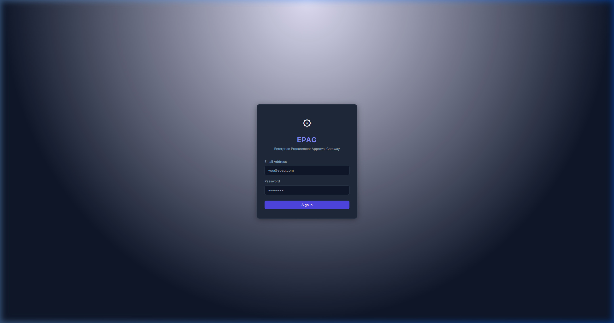
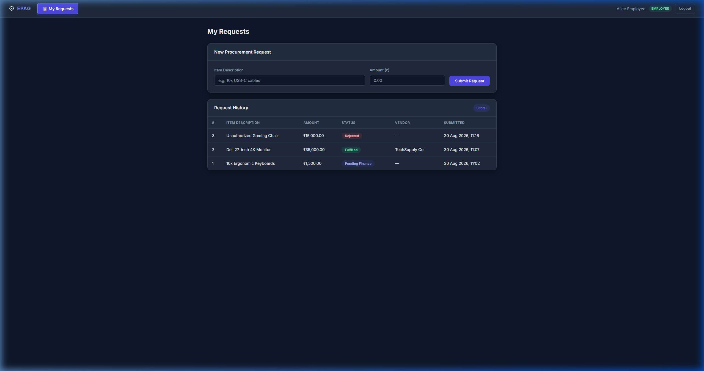

<div align="center">

<h1>⚙️ EPAG</h1>
<h3>Enterprise Procurement Approval Gateway</h3>

<p>A professional multi-role procurement workflow system built with PHP 8 MVC — featuring role-gated dashboards, multi-stage approvals, vendor management, and a complete audit trail.</p>

<p>
  
  
  
  
</p>

</div>

---

## 📸 Screenshots

<table>
  <tr>
    <td align="center"><b>🔐 Login Page</b></td>
    <td align="center"><b>📋 Employee Dashboard</b></td>
  </tr>
  <tr>
    <td></td>
    <td></td>
  </tr>
</table>

---

## 🔄 Approval Workflow

```
Employee Submits Request
       │
       ▼
  Manager Review  ──(Reject)──▶  Rejected ✗
       │
       ▼
  Finance Review  ──(Reject)──▶  Rejected ✗
       │
       ▼
Materials Fulfillment (picks vendor)
       │
       ▼
   Fulfilled ✓
```

---

## 🏗️ Project Structure

```
EPAG/
├── config/
│   └── db.php                  # PDO connection (MySQL + SQLite fallback)
├── controllers/
│   ├── AuthController.php      # Login / logout
│   ├── RequestController.php   # Employee request submission
│   ├── ApprovalController.php  # Manager / Finance / Materials approval
│   ├── VendorController.php    # Vendor creation (materials role)
│   └── AuditController.php     # Audit log viewer
├── models/
│   ├── Request.php             # Procurement request CRUD
│   ├── Approval.php            # Approval records
│   ├── Vendor.php              # Vendor management
│   ├── User.php                # User lookups
│   └── AuditLog.php            # Audit trail
├── views/
│   ├── login.php               # Login form
│   ├── employee_dashboard.php  # Submit & track requests
│   ├── manager_dashboard.php   # Approve / reject for managers
│   ├── finance_dashboard.php   # Finance stage approval
│   ├── materials_dashboard.php # Materials fulfillment + vendor creation
│   ├── audit_log.php           # Full audit trail (admin)
│   └── partials/navbar.php     # Shared navigation bar
├── public/
│   ├── css/style.css           # Dark-mode UI design system
│   └── js/app.js               # Double-submit guard + toast notifications
├── database/
│   ├── schema.sql              # Full DB schema
│   ├── seed.sql                # Seed data
│   └── epag.sqlite             # SQLite database (dev)
└── index.php                   # Front controller / router
```

---

## 🚀 Quick Start (PHP Built-in Server)

```bash
# 1. Clone the repo
git clone https://github.com/ftaakash/EPAG.git
cd EPAG

# 2. Start the local server (requires PHP 8+)
php -S localhost:8000

# 3. Open your browser
http://localhost:8000
```

---

## 👥 Role Logins & Passwords

| Role      | Email                  | Password    | Access |
|-----------|------------------------|-------------|--------|
| 👤 Employee  | employee@epag.com   | `employee`  | Submit & track procurement requests |
| 🧑‍💼 Manager  | manager@epag.com    | `manager`   | Approve or reject at Stage 1 |
| 💰 Finance   | finance@epag.com    | `finance`   | Approve or reject at Stage 2 |
| 📦 Materials | materials@epag.com  | `materials` | Fulfill requests, assign vendors, add new vendors |
| 🔑 Admin     | admin@epag.com      | `admin`     | View full audit log |

---

## ✨ Key Features

- **Multi-Stage Approval Chain** — Employee → Manager → Finance → Materials
- **Role-Gated Dashboards** — Each role sees only their relevant queue
- **Vendor Management** — Materials role can add new vendors on the fly
- **Audit Trail** — Every approval, rejection, and vendor action is logged
- **Dark Mode UI** — Premium, glassmorphism-inspired professional design
- **SQLite Fallback** — Works out-of-the-box without a MySQL setup
- **Strict Authentication** — Unique role-specific passwords per account

---

## 🛠️ Tech Stack

| Layer | Technology |
|---|---|
| Backend | PHP 8.3 (manual MVC, no framework) |
| Database | MySQL (production) / SQLite (development fallback) |
| Frontend | HTML5 + Vanilla CSS + JavaScript |
| Auth | PHP `password_hash` / `password_verify` + Sessions |
| Server | XAMPP / PHP Built-in Server |

---

## 📄 License

MIT License — feel free to use, fork, and build on top of EPAG.
